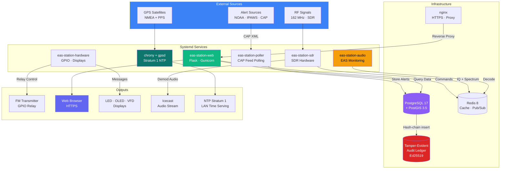

#  EAS Station™

[](https://github.com/KR8MER/eas-station/actions/workflows/tests.yml)
[](https://www.gnu.org/licenses/agpl-3.0)
[](LICENSE-COMMERCIAL)
[](docs/reference/CHANGELOG.md)
[](https://ko-fi.com/easstation)
[](https://www.raspberrypi.com/)
[](https://www.python.org/)
[](https://flask.palletsprojects.com/)
[](https://werkzeug.palletsprojects.com/)
[](https://jinja.palletsprojects.com/)
[](https://socket.io/)
[](https://www.sqlalchemy.org/)
[](https://alembic.sqlalchemy.org/)
[](https://www.postgresql.org/)
[](https://redis.io/)
[](https://gunicorn.org/)
[](https://www.gevent.org/)
[](https://nginx.org/)
[](https://letsencrypt.org/)
[](https://systemd.io/)
[](https://icecast.org/)
[](https://github.com/pothosware/SoapySDR)
[](https://ffmpeg.org/)
[](https://github.com/jiaaro/pydub)
[](https://github.com/espeak-ng/espeak-ng)
[](https://numpy.org/)
[](https://scipy.org/)
[](https://numba.pydata.org/)
[](https://lxml.de/)
[](https://python-pillow.org/)
[](https://getbootstrap.com/)
[](https://fontawesome.com/)
[](https://leafletjs.com/)
[](https://www.chartjs.org/)
[](https://pyauth.github.io/pyotp/)
[](https://cryptography.io/)
[](https://www.twilio.com/)
[](https://chrony-project.org/)
[](https://gpsd.gitlab.io/gpsd/)
[](#timekeeping--a-broadcast-grade-time-source-built-in)

> **An open, software-defined Emergency Alert System platform — the kind of infrastructure that used to cost $5,000–$7,000 per appliance, now running on a $80 Raspberry Pi at roughly 12 watts.**

EAS Station™ is a complete CAP-to-broadcast research and training platform: it pulls Common Alerting Protocol feeds from NOAA/NWS and FEMA IPAWS, encodes FCC-Part-11-compliant SAME audio, verifies the result on the air with a software-defined radio, geofences every message against PostGIS-backed boundary data, disciplines its own clock from GPS satellites to **stratum 1**, and records every operator action into a cryptographically tamper-evident audit ledger. It does all of this from a single Raspberry Pi 5 — or any Linux server — wired together from boring, battle-tested open-source components instead of a proprietary appliance.

The project's long-term goal is to be a credible, auditable, drop-in alternative to commercial encoder/decoder hardware for laboratories, training programs, and broadcasters who want to understand and own the stack instead of leasing a black box.

---

> ⚠️ **Laboratory / Research Use Only** — EAS Station™ generates valid SAME headers and attention tones that will trigger downstream EAS equipment. It is **not FCC-certified** and must only be operated in controlled test environments. Never connect it to on-air RF, an STL path, or a public streaming chain without explicit authorization. See [Legal & Compliance](#-legal--compliance).

---

## 📸 Screenshot Tour

A few of the web dashboards, captured from a running instance with sample alert data (Lightning theme — 19 other built-in themes ship in the box).

| Operational Dashboard | Live Alert Timeline |
|---|---|
| [](docs/screenshots/dashboard.jpg) | [](docs/screenshots/alerts.jpg) |
| **Overview** — current alert state, PostGIS coverage map, and live platform-capability status. | **Alerts** — deduplicated NOAA/IPAWS feed with severity, urgency, source and per-alert actions. |

| Analytics & Statistics | EAS Compliance |
|---|---|
| [](docs/screenshots/stats.jpg) | [](docs/screenshots/compliance.jpg) |
| **Statistics** — Chart.js distribution, temporal patterns, EAS-forwarding funnel and one-click PDF export. | **Compliance** — Required Weekly / Monthly Test cadence surfaced so audit gaps are caught early. |

| Tamper-Evident Audit Ledger | SDR Radio Diagnostics |
|---|---|
| [](docs/screenshots/audit-log.jpg) | [](docs/screenshots/radio-diagnostics.jpg) |
| **Audit** — Ed25519-signed, hash-chained log with one-click **Verify Chain Integrity**. | **SDR** — receiver status, off-air verification and IQ-capture tooling for the SoapySDR layer. |

| GPS & Time (Stratum 1) | System Health |
|---|---|
| [](docs/screenshots/gps-dashboard.jpg) | [](docs/screenshots/system-health.jpg) |
| **GPS & Time** — polar sky plot, `chronyc` tracking and per-PRN signal levels for stratum-1 NTP. | **System Health** — CPU / memory / disk / temperature with historical trends. |

| Security Center | Role-Based Access Control |
|---|---|
| [](docs/screenshots/security-center.jpg) | [](docs/screenshots/rbac.jpg) |
| **Security Center** — traffic analytics, anomaly detection (scanners, login brute-force, error spikes) and one global ban list enforced across every layer. | **RBAC** — Admin / Operator / Viewer roles with per-permission scoping, editable from the UI. |

| Broadcast Builder | Theme Selector |
|---|---|
| [](docs/screenshots/broadcast-builder.jpg) | [](docs/screenshots/theme-gallery.jpg) |
| **Broadcast Builder** — compose manual SAME activations, generate the audio package and review recent transmissions, with the station's originator / station ID / attention-tone settings shown inline. | **Themes** — 20 built-in themes (11 light, 9 dark), each WCAG-AA audited; import/export custom themes as JSON. |

**Radar reflectivity overlay** — weather alerts get a live "Radar (at time of alert)" toggle on the Coverage Map, pulling NEXRAD Level III base reflectivity from Iowa Environmental Mesonet's public WMS-T mosaic (historical for a past alert, live for one still active), plus a Radar Loop card below that steps through the alert's full duration at 5-minute cadence from that same Level III mosaic. A separate **High-Resolution Radar Loop** card sits below it, offering raw NEXRAD **Level II** data (NOAA's public archive, decoded on the appliance via Py-ART) from the single nearest radar site — each gate drawn at its true resolution, not interpolated, sharpest close to the site and gradually coarser at range as the hardware's own beam width grows with distance — plus a Reflectivity/Velocity selector, since velocity (useful for spotting rotation) has no Level III equivalent at all. Deliberately a separate, distinctly-labeled view rather than a silent upgrade to the standard toggle/loop, which the two can legitimately disagree with since they're different data sources:

| Live toggle (Level III mosaic) | High-Resolution Radar Loop (Level II, ~90 miles from its site) |
|---|---|
| [](docs/screenshots/radar-overlay.jpg) | [](docs/screenshots/radar-loop.jpg) |

### Physical Displays

Every panel below is a pixel-accurate render from the actual driver code (`app_core/oled.py`, `scripts/vfd_controller.py`, `scripts/led_sign_controller.py`), not a mockup — icons, gauges, the compass dial and bar charts are all real primitives an operator standing at the hardware sees, driven by the same [`/screens`](#-what-the-platform-actually-does) template engine that powers custom screens.

**OLED (SSD1306, 128×64)** — clock face, GPS fix with a heading compass and per-satellite signal bars, system/audio/EAS health, receivers, and GPIO relay status:

[](docs/screenshots/oled-displays.png)

**VFD (Noritake GU140x32F-7000B, 140×32, blue-green vacuum-fluorescent glow)** — eleven screens, matching the OLED's breadth: a time/date/alert-count status screen, a dedicated active-alert screen, system meters, a segmented-LED audio VU meter, GPS status with a heading compass, network status, GPIO relay status, an EAS decoder health gauge, audio source health, the IPAWS poller, and receiver signal strength. A second, larger 14pt bold font gives each screen's single most important value (a clock, a percentage, a count) real typographic weight instead of a flat wall of 7px text. The rotation keeps cycling through an active alert instead of freezing, so the alert screen actually gets its turn:

[](docs/screenshots/vfd-displays.png)

**LED sign (Alpha 9120C, amber/red/green dot-matrix)** — 6 scrolling/held text screens plus 3 new single-row graphics screens (Status, Alert, System) using the sign's real Picture File protocol command instead of text, each leading with one large hero value — a clock, an alert count, a CPU percentage — the same way the VFD's screens do:

[](docs/screenshots/led-displays.png)

> Screenshots are captured from the bundled dashboards; map basemap tiles and live SDR/GPS telemetry depend on network access and attached hardware. The OLED/VFD/LED panels use representative sample data, not a live station's actual telemetry.

---

## 🎯 Who This Is For, and What It's For

EAS Station™ was built because the existing EAS appliance market is closed, expensive, and impossible to audit. The platform reframes the same workflows as transparent, inspectable, programmable infrastructure — useful across several distinct audiences:

### Public-Safety Agencies & Emergency Management Offices
**Use it to:** stand up a non-production training rig that mirrors the agency's real CAP/IPAWS workflow, validate FIPS-code and NWS-zone coverage before an exercise, run tabletop drills with realistic alert ingestion and replay, and prototype custom alert distribution (LED signage in EOCs, GPIO triggers to siren controllers, SMS/email/SNMP notifications to on-call staff) without touching the production warning system.

### Broadcasters & Engineering Departments
**Use it to:** experiment with CAP-to-SAME workflows in a bench environment that costs less than a single appliance service contract, evaluate SDR-based off-air verification against an existing encoder, document Required Weekly Test (RWT) and Required Monthly Test (RMT) compliance for audit purposes, and pilot ideas — multi-receiver coordination, alert geofencing, audit-trail integrity — that an operations team can later take to vendors as a requirement spec.

### Amateur Radio: ARES, RACES, SKYWARN, Public-Service Nets
**Use it to:** run realistic CAP-to-EAS training exercises during nets, integrate EAS audio with two-way LMR systems via MDC1200 selective calling (PTT-ID, Emergency, Voice Selective Call), build SKYWARN spotter feedback loops with PostGIS-targeted alert subscription, and operate a stratum-1 GPS-disciplined NTP server for the rest of the club's lab — all on the same Pi.

### Universities, Research Labs & Standards Work
**Use it to:** teach FCC Part 11 / NRSC-4-B SAME modulation hands-on, study CAP 1.2 schema parsing and IPAWS authentication, instrument an end-to-end alert pipeline for software-engineering coursework, or use the running system as the test article in research on alert latency, integrity, geographic targeting accuracy, or social-science studies of alert effectiveness.

### Telecom / Utility / Critical Infrastructure Operators
**Use it to:** subscribe to weather and infrastructure alerts for an operations center, drive site-local signage and PA chains via the GPIO/serial display layer, integrate compliance-health monitoring into existing NMS via SNMP traps, and treat alert ingestion as auditable infrastructure rather than a manual-watch role.

### Software Engineers & Open-Source Contributors
**Use it as:** a non-trivial, full-stack reference application — Flask + SQLAlchemy + PostGIS + Redis + Socket.IO + SoapySDR + systemd — with real DSP, real spatial queries, real hardware I/O, real cryptographic audit chaining, and a meaningful test suite. Build CAP integrations against the REST API, or contribute upstream.

---

## 🧭 What the Platform Actually Does

Rather than a feature checklist, here is the platform organized around the real operational responsibilities it takes off the operator's plate.

### Alert Ingestion — A Reliable Front Door for CAP

The poller subsystem maintains continuous, deduplicated subscriptions to **NOAA/NWS** and **FEMA IPAWS** CAP feeds, plus any number of additional CAP 1.2 endpoints an organization wants to add (state warning points, municipal feeds, internal test sources). Alerts are parsed with `lxml` (5–10× faster than the stdlib parser), normalized, deduplicated, and committed to PostgreSQL/PostGIS with full geographic context. A stalled feed is detected and auto-resumed rather than silently dropping events. For agencies validating their footprint, a built-in **setup wizard** walks operators through finding their FIPS county codes and NWS forecast zones.

**Why it matters institutionally:** The most common operational failure in alert systems is silent feed loss. The poller is built to make that visible — on the dashboard, in the logs, in the audit trail — instead of hiding it.

### SAME Encoding & On-Air Broadcast Workflow

The encoder generates bit-perfect Specific Area Message Encoding headers per **FCC Part 11** and **NRSC-4-B**, complete with the 853/960 Hz two-tone attention sequence, optional eSpeak NG (or Azure Cognitive Services) text-to-speech voice-over with operator-tunable phonetic normalization for road numbers and abbreviations, and an EOM bookend. A **manual EAS workflow** lets training staff print custom drill messages, an **RWT/RMT scheduler** automates the FCC-required weekly and monthly tests, and the **EAS Compliance dashboard** surfaces the cadence so gaps are caught before an audit.

**Beyond the broadcast chain**, the encoder also supports a family of **pre/post-alert signaling profiles** designed for forwarding EAS audio over a Motorola-style two-way LMR network: **MDC1200** (PTT-ID Pre/Post, Emergency, Request-to-Talk, Remote Monitor, Call Alert, Voice Selective Call), **Quick-Call II**, and **DTMF**. This makes the platform usable as a CAP-to-LMR bridge for public-safety voice systems that already exist on a county or campus.

### SDR Verification — Closing the Loop Off-Air

A separate `eas-station-sdr` service uses **RTL-SDR, Airspy, or SDRplay** receivers (via the SoapySDR abstraction) to demodulate the actual RF, decode received SAME headers in real time, and prove that what went out of the transmitter is what the encoder commanded. Verification cross-checks have been validated against `multimon-ng` for decoding parity. A **live, continuously-updating waterfall** on the Radio Receiver Diagnostics page lets an engineer watch a frequency the way they would on a benchtop spectrum analyzer; a one-click **"Capture IQ" button** records a one-second complex64 `.npy` recording per receiver and streams it to the browser via a single-use download URL — feed it straight into `scripts/rbds_diagnose.py`, `inspectrum`, or GNU Radio for offline forensic work without SSH-ing into the host. The same SDR pipeline also carries a full **RBDS / RDS decoder** (PTYN, AF method-B, Linkage Actuator, Slow Labelling, Open Data Applications, Fast Switching) and an **Icecast streaming layer** so any number of remote listeners can monitor demodulated audio over HTTP.

**Why it matters institutionally:** Most encoder vendors do not publish how they verify their own output, and there's no second pair of ears in the rack. This subsystem makes off-air verification a property of the platform, not the operator's headphones.

### Geographic Intelligence — Alerts Matched to a Real Footprint

PostGIS is treated as a first-class component, not an optional add-on. County and NWS zone boundaries are loaded from authoritative sources (U.S. Census **TIGER/Line**, NOAA/NWS, and contributed local GIS offices), and every incoming alert is matched against the station's coverage polygon with real spatial queries. Custom **shapefile import** lets organizations add their own service-area definitions (utility territories, school district boundaries, campus polygons), and the **interactive Leaflet maps** in the dashboard let operators see the alert area and the station footprint together at a glance.

### Timekeeping — A Broadcast-Grade Time Source Built In

Every EAS event is timestamped, geofenced, and audited — and a station that drifts seconds against NIST is a station whose RWT logs and CAP `sent`/`effective`/`expires` math eventually cease to match the real world. The reference build pairs a **u-blox MAX-M8Q multi-GNSS GPS HAT** (or Adafruit MTK3339 as a drop-in alternative) with hardware **Pulse-Per-Second** and a battery-backed RTC. `chrony` consumes the NMEA fix and the PPS edge as a kernel refclock, so the station serves NTP at **true stratum 1** with no upstream internet time required and survives complete network isolation. A dedicated **GPS & Time Dashboard** at `/admin/gps-dashboard` presents a polar sky plot coloured by constellation, full `chronyc tracking` parsing, per-PRN signal-level bars, parsed `chronyc sources`, and a logarithmic sync-health meter — modelled visually on W0CHP's chrogps-dash. A one-click checklist under Admin → Hardware probes every prerequisite (RTC overlay, PPS device, package state, `/boot/firmware/config.txt`) and offers a single **Run** button per remediation step, so the system can be brought up by an operator who has never edited `chrony.conf` by hand.

**Beyond compliance, this is a useful capability in its own right** — the platform serves NTP to the rest of a lab, EOC, or campus rack as a side effect of being a correctly-clocked EAS encoder.

### Tamper-Evident Audit Ledger — Integrity You Can Prove

Every alert insert, encoder action, and operator change is recorded into the existing `audit_logs` table — but with a tamper-evidence layer that was added in v2.75. Each row carries the SHA-256 of its predecessor's `entry_hash`, an SHA-256 over its own canonical-JSON content (including the prev-link), and an **Ed25519 signature** over that hash. The signing key is generated by the installer at `/opt/eas-station/secrets/audit_signing.key` and deliberately lives **outside the database** — so an attacker with database access cannot re-sign rows they have edited. Verification is one click in the web UI: **System Logs → Audit → Verify Chain Integrity** (or `GET /security/audit-logs/verify`) walks the table, checks every signed row's prev-link, recomputes its content hash, and verifies the signature — reporting the exact first bad row if integrity has been broken, and recording the verification run itself into the chain. Full design and threat model: [docs/security/AUDIT_LOG_INTEGRITY.md](docs/security/AUDIT_LOG_INTEGRITY.md).

**Why it matters institutionally:** This is the difference between "we logged it" and "we can prove the log hasn't been edited." For incident reviews, regulator interaction, training-program documentation, or research integrity, that distinction is the whole point.

### Uptime & Reliability Diagnostics — Beyond "Is the Process Running?"

`Restart=always` only catches a crashed process; it says nothing about one that's still running but **deadlocked**. Both `eas-station-audio` and `eas-station-poller` are systemd `Type=notify` units that send `WATCHDOG=1` heartbeats from their own main loop, so a genuine hang now gets killed and restarted too. An **outbound heartbeat** (Settings → Uptime Heartbeat) pings an external monitor such as healthchecks.io on a schedule — the one check on the box that's designed to fail *outward* when the whole box, its power, or its network goes dark, rather than only reporting inward to a dashboard nobody's watching at 3 a.m. **Backup restore verification** (`tools/verify_backup_restore.py`, Admin → Backups) actually restores the latest backup's database dump into a throwaway scratch database and sanity-checks it — proving a backup restores, not just that a file exists — on demand or automatically after every scheduled backup. A **Clock Sync** card on `/system_health` watches chrony/NTP drift, since SAME timing and RWT scheduling both depend on correct wall-clock time. And a **combined NOAA+IPAWS feed-loss alarm** tracks each poller's staleness independently, so a live feed can never mask a dead one — the alert only fires when both feeds have stalled past a configurable threshold.

### Hardware Integration — The Things the System Actually Has to Drive

The platform was designed under the assumption that an EAS station is not a pure software product — it has to flip relays and drive signs. The hardware service exposes:
- **GPIO relay control** for transmitter PTT lines and external equipment
- **OLED status panels** (Argon, generic SSD1306/SH1106) for at-a-glance current-alert state
- **VFD displays** with a custom screen editor and bitmap support
- **Scrolling LED signage** over RS-232 (and RS-232-over-Ethernet) for EOC and lobby installations
- **NeoPixel / WS2812B** addressable strips for status walls
- **Zigbee** (via Argon40 ZNP) for optional wireless sensor and device control
- **GPIO pin map** in the web UI so what's wired and what's firing is never a mystery

### Security, Notifications & Operations

The web tier is built for organizations that have to share operator credentials safely: **role-based access control** (admin / operator / viewer), **TOTP multi-factor authentication** with QR-code enrollment, **scoped API keys** for automation *(planned — see [docs/guides/API_KEY_MANAGEMENT](docs/guides/API_KEY_MANAGEMENT.md))*, **Redis-backed rate limiting** on login and webhook endpoints, **CSRF protection** on every state-changing endpoint, and **nginx HTTPS** with optional automatic Let's Encrypt provisioning. **Tailscale integration** offers a one-tab path to private-network access for distributed teams.

Outbound notifications cover **email** (SMTP, with an optional bundled local Postfix relay), **SMS** (Twilio), and **SNMP v2c traps** for integration with existing NMS platforms.

Day-to-day operations are made survivable by a **whiptail TUI configurator** (`sudo eas-config`), automatic **Alembic migrations** with a recovery script for half-applied schema changes, **pre-flight backup tooling** (`tools/create_backup.py`), **one-button in-place upgrades** (runs `update.sh` as its own systemd unit and streams progress to the page), a comprehensive **web diagnostics page** plus CLI scripts, and an in-browser **journalctl log viewer** and **documentation reader** that renders the full 90+ document library.

### Web Dashboard & REST API

The UI is a **responsive Bootstrap 5** application with **20 built-in themes** (every page including the Changelog viewer driven by theme CSS custom properties), **live Socket.IO push** for alert / radio / GPS updates, a full alert timeline with search and filter, an **Analytics dashboard** with Chart.js visualizations and one-click client-side PDF export of the full statistics report, an **audio monitoring** view with playback and live receive history, **operator-selectable display units** (coordinate format, altitude, speed, distance) saved per browser, and a **System Health** panel surfacing CPU/memory/disk/temperature. A self-refreshing **System Status strip** on the main dashboard puts active-alert count, EAS decoder state, overall app health, and configured-receiver count above the map, so the four things an operator checks first are visible without navigating anywhere.

Everything in the UI is reachable from a **REST API** namespaced under `/api/`, authenticated by the same login session as the UI (scoped `X-API-Key` authentication is planned), with a vendored JavaScript client for browser-side integrations.

---

## 🏗️ Architecture

The platform is intentionally split into focused systemd services so a web crash never affects audio, and a hardware fault never brings down the dashboard.



| Service | Responsibility |
|---------|---------------|
| **eas-station-web** | Flask UI, REST API, dashboards — no direct hardware access |
| **eas-station-poller** | CAP feed polling, XML parsing, deduplication, database writes |
| **eas-station-sdr** | SDR capture, FM demodulation, SAME decoding, RBDS, Icecast streaming, IQ capture |
| **eas-station-hardware** | GPIO relays, OLED/VFD/LED displays, NeoPixel, Zigbee |
| **eas-station-audio** | Audio processing, EAS monitoring, Redis pub/sub |
| **chrony + gpsd** | GPS-disciplined kernel refclock; stratum-1 NTP serving |

**Infrastructure:** PostgreSQL 17 + PostGIS 3.5 for persistent storage · Redis 8 for real-time metrics and inter-service messaging · nginx for HTTPS termination · chrony + gpsd for stratum-1 time.

**Frontend libraries (all vendored locally under `static/vendor/`):** Bootstrap 5, jQuery, Font Awesome, Leaflet (maps), Mermaid (diagrams), Chart.js 3 with the datalabels, matrix and date-fns adapter plugins (dashboards), and jsPDF + html2canvas (client-side PDF report export).

---

## 🚀 Quick Start

### One-Command Install

```bash
git clone https://github.com/KR8MER/eas-station.git
cd eas-station
sudo bash install.sh
```

The interactive **whiptail TUI installer** is built for the case where the person installing the station is not the person who wrote the software. It guides operators through every option and handles the rest automatically:

| What you configure | What the installer does for you |
|---|---|
| Admin account (user / pass / email) | Installs PostgreSQL, Redis, Python, nginx |
| Hostname, domain, callsign, EAS originator | Generates a secure 64-char `SECRET_KEY` |
| State, county, FIPS / NWS zone codes | Runs Alembic database migrations |
| Alert sources (NOAA, IPAWS) | Creates your administrator account |
| Icecast streaming passwords | Generates the Ed25519 audit-log signing key |
| Hardware (GPIO, LED, VFD, Zigbee, GPS HAT) | Starts all systemd services |
| Tailscale / SSL preferences | Configures nginx with SSL (Let's Encrypt optional) |

Then open **https://your-server-ip** and log in — the station is live.

> 💡 **Debian 13 (Trixie) and Python 3.13 are required.** The installer auto-detects the host OS and selects the right packages.

### Update an Existing Installation

```bash
cd /opt/eas-station
sudo bash update.sh
```

Optional backup → stop services → pull latest code → preserve `.env` → run Alembic migrations (and refuse to fall back to `db.create_all()` if a migration fails, so a clean error is never traded for a half-migrated database) → restart everything.

### Reconfigure After Install

```bash
sudo eas-config        # interactive whiptail TUI for any .env setting
```

Or visit `/settings` in the web UI for hardware, Icecast, notifications, TTS, FIPS codes, broadcast settings, and more. Anything that was historically an `.env` variable but is now a runtime concern (poller cadence, broadcast settings, notifications, application logging) lives in dedicated DB tables — `.env` is reserved for boot-time infrastructure only.

### Uninstall

```bash
sudo bash uninstall.sh   # stops services, removes files, optionally removes PostgreSQL/Redis/nginx
```

---

## ⚙️ System Requirements

| Category | Minimum | Recommended |
|----------|---------|-------------|
| **Compute** | 2-core CPU, 2 GB RAM | Raspberry Pi 5 (8 GB) or x86 server |
| **Storage** | 20 GB | 50 GB+ SSD (alerts database grows over time) |
| **OS** | Debian 13 (Trixie) · Raspberry Pi OS (Trixie-based) | Debian 13 (Trixie) · Raspberry Pi OS (Trixie-based) |
| **Python** | 3.13 | 3.13 |
| **SDR** | *(optional)* RTL-SDR v3 | Airspy R2/Mini · SDRplay |
| **GPS** | *(optional)* any NMEA UART | Uputronics MAX-M8Q HAT + PPS |
| **GPIO** | *(optional)* any relay HAT | Multi-relay HAT + USB sound card |

Typical power draw at the reference Pi 5 build with SDR + GPS HAT: **~12 W**. See [requirements.txt](requirements.txt) for the full Python dependency list.

---

## 📈 Where the Project Is Today

| Status | Capability |
|--------|------------|
| ✅ Done | Multi-source CAP ingestion (NOAA, IPAWS, custom) with PostGIS targeting |
| ✅ Done | FCC Part 11 / NRSC-4-B SAME encoding with manual workflow and TTS narration |
| ✅ Done | SDR off-air verification with live waterfall and one-click IQ capture |
| ✅ Done | RBDS / RDS decoder with full Group 1A / 7A / 13A / 15B parsing |
| ✅ Done | MDC1200 / Quick-Call II / DTMF pre/post-alert signaling for LMR forwarding |
| ✅ Done | Stratum 1 GPS-disciplined time source + dedicated GPS & Time Dashboard with historical trend charts (clock discipline, PPS jitter, satellites, SoC temperature) |
| ✅ Done | Tamper-evident Ed25519-signed audit ledger with chain verification |
| ✅ Done | RBAC, TOTP MFA, rate limiting, CSRF, HTTPS |
| ⏳ Planned | Scoped API keys for external automation |
| ✅ Done | Automated RWT/RMT scheduling and EAS Compliance dashboard |
| ✅ Done | LED / OLED / VFD / NeoPixel / GPIO / Zigbee hardware integration, with a GPIO Pin Map that live-detects wiring conflicts |
| ✅ Done | Settings Hub, web diagnostics, one-button upgrade, journalctl viewer |
| ✅ Done | Uptime & reliability diagnostics — hang watchdog, outbound dead-man's-switch heartbeat, backup-restore verification, clock/NTP drift monitoring, combined NOAA+IPAWS feed-loss alarm |
| ✅ Done | Independent multi-receiver monitoring — per-receiver waterfall/spectrum/historical trends, per-source dead-air detection with independent thresholds |
| ✅ Done | Relay interlock groups — mutual exclusion between GPIO relays (e.g. two PTT lines that must never key together) |
| ✅ Done | GPIO input triggers — configure a GPIO pin as a physical button that triggers an action (Run RWT Now, Forward Last Alert, Acknowledge Dead Air, Dump/Abort Broadcast) |
| 🔄 In Progress | Automatic receiver failover |
| 🔄 In Progress | FCC rulemaking engagement — [comments filed](https://www.fcc.gov/ecfs/search/search-filings/filing/1060881335987) in PS Docket No. 25-224 supporting software-defined EAS (a first step toward a possible certification path) |
| ✅ Done | FCC Part 11 rule-by-rule [compliance traceability matrix](docs/process/FCC_PART11_COMPLIANCE_MATRIX.md) and [certification-grade reliability plan](docs/process/certification_reliability_plan.md) — actual certification is still blocked pending the FCC rulemaking above, not by missing documentation |
| ⏳ Planned | Cloud sync, mobile app, multi-site coordination |

See the [Changelog](docs/reference/CHANGELOG.md) for details.

---

## 📚 Documentation

| Topic | Link |
|-------|------|
| **Setup & Installation** | [docs/guides/SETUP_INSTRUCTIONS](docs/guides/SETUP_INSTRUCTIONS.md) |
| **Quickstart** | [docs/installation/QUICKSTART](docs/installation/QUICKSTART.md) |
| **SDR Configuration** | [docs/hardware/SDR_SETUP](docs/hardware/SDR_SETUP.md) |
| **GPS HAT / Stratum 1** | [docs/hardware/GPS_HAT_SETUP](docs/hardware/GPS_HAT_SETUP.md) |
| **Hardware Quickstart** | [docs/guides/HARDWARE_QUICKSTART](docs/guides/HARDWARE_QUICKSTART.md) |
| **Alert Signals (MDC1200 / QC-II / DTMF)** | [docs/guides/ALERT_SIGNALS](docs/guides/ALERT_SIGNALS.md) |
| **Audit Log Review** | [docs/guides/AUDIT_LOG_REVIEW](docs/guides/AUDIT_LOG_REVIEW.md) |
| **MFA / TOTP Setup** | [docs/guides/MFA_TOTP_SETUP](docs/guides/MFA_TOTP_SETUP.md) |
| **Icecast Streaming** | [docs/guides/ICECAST_STREAMING_SETUP](docs/guides/ICECAST_STREAMING_SETUP.md) |
| **Tailscale Setup** | [docs/guides/TAILSCALE_SETUP](docs/guides/TAILSCALE_SETUP.md) |
| **Daily Operations** | [docs/guides/HELP](docs/guides/HELP.md) |
| **REST / JS API Reference** | [docs/frontend/JAVASCRIPT_API](docs/frontend/JAVASCRIPT_API.md) |
| **System Architecture** | [docs/architecture/SYSTEM_ARCHITECTURE](docs/architecture/SYSTEM_ARCHITECTURE.md) |
| **Theory of Operation** | [docs/architecture/THEORY_OF_OPERATION](docs/architecture/THEORY_OF_OPERATION.md) |
| **SAME Protocol Reference** | [docs/reference/protocols/SAME](docs/reference/protocols/SAME.md) |
| **MDC1200 Protocol Reference** | [docs/reference/protocols/MDC1200](docs/reference/protocols/MDC1200.md) |
| **Developer Guide** | [docs/development/AGENTS](docs/development/AGENTS.md) |
| **Changelog** | [docs/reference/CHANGELOG](docs/reference/CHANGELOG.md) |

---

## 🤝 Contributing

```bash
git clone https://github.com/KR8MER/eas-station.git
cd eas-station
python3 -m venv venv && source venv/bin/activate
pip install -r requirements.txt
cp .env.example .env   # edit with local DB settings
python app.py
```

See the [Contributing Guide](docs/process/CONTRIBUTING.md) and the [Code Standards](docs/development/AGENTS.md). When bumping any dependency in `requirements.txt`, also update the matching badge above and the live footer partial at `templates/partials/tech_stack_badges.html` — the drift guard `tests/test_tech_stack_badges.py` will fail CI otherwise.

---

## ❤️ Support the Project

EAS Station™ is free and open source, built and maintained in the open. If the platform is useful to you — in the lab, the shack, or the classroom — a one-time or monthly donation keeps development going.

[](https://ko-fi.com/easstation)

👉 **[ko-fi.com/easstation](https://ko-fi.com/easstation)** — or use the **Sponsor** button at the top of the repository.

---

## ⚖️ Legal & Compliance

> 🚨 **EAS Station™ generates valid SAME headers and attention tones.** These signals will trigger downstream EAS equipment if coupled to any RF, STL, or streaming chain.
>
> - **Not FCC-certified** — for laboratory, research, and training use only.
> - **Never connect to on-air infrastructure** without explicit authorization.
> - **Real operational semantics only — no fictional or entertainment use.** EAS Station™ is built to emulate the *actual* behavior of certified EAS encoder/decoder equipment for research, training, and Part 97 amateur-radio experimentation. It is **not** a content-creation toolkit. Do **not** use it to author fictional or fabricated EAS workflows (invented event codes, mock CAP feeds presented as real, joke RWT/RMT cycles, "what-if" alert scenarios) and do **not** use its output in films, TV, trailers, advertising, podcasts, streaming, video games, livestream stunts, prank/creepypasta content, ARGs, or any other entertainment or media production. Labeling content as fiction does **not** cure the violation — 47 C.F.R. § 11.45 applies regardless of intent (see the *Olympus Has Fallen* trailer case below).
> - Unauthorized broadcast has real consequences: iHeartMedia paid a [$1M settlement](https://docs.fcc.gov/public/attachments/DA-15-199A1.pdf) (2015); the *Olympus Has Fallen* trailer misuse cost [$1.9M](https://docs.fcc.gov/public/attachments/DA-14-1097A1.pdf).
> - The maintainer will cooperate fully with authorities against any misuse.

See [Terms of Use](docs/policies/TERMS_OF_USE.md), [Privacy Policy](docs/policies/PRIVACY_POLICY.md), [FCC Compliance / About](docs/reference/ABOUT.md), and the [Trademark Policy](docs/policies/TRADEMARK_POLICY.md).

---

## 📜 License

EAS Station™ is **dual-licensed**:

### Open Source — AGPL v3
Free to use, modify, and distribute under the [GNU Affero General Public License v3](LICENSE). Modifications to network-deployed versions must be made available as source.

### Commercial License
For proprietary or closed-source use without AGPL obligations — no source disclosure required, priority support, custom development assistance. See [LICENSE-COMMERCIAL](LICENSE-COMMERCIAL).

```
Copyright (c) 2025-2026 EAS Station, LLC (KR8MER)
EAS Station™ — https://github.com/KR8MER/eas-station
```

Branding governed by the [Trademark Policy](docs/policies/TRADEMARK_POLICY.md). See [NOTICE](NOTICE) for required attribution details.

---

## 📚 Attributions & Open‑Source Credits

EAS Station™ stands on the shoulders of an enormous open‑source ecosystem. The badges at the top of this README are a curated highlight; this section is the exhaustive list of every third‑party library, system package, and CDN asset the project relies on. Each entry explains what role that library plays inside EAS Station™, not just what the upstream project is. Versions track [`requirements.txt`](requirements.txt) and the system‑package install scripts in [`scripts/`](scripts/).

> The drift guard `tests/test_tech_stack_badges.py`, run on every PR and push by `.github/workflows/tests.yml`, enforces that the curated badge subset in this README, in `templates/partials/tech_stack_badges.html` (the live page footer), and in `requirements.txt` stay aligned. Bumping a dependency means updating all three.

### Python runtime, framework & extensions

| Library | Version | License | Purpose in EAS Station™ | Project |
|---|---|---|---|---|
| Flask | 3.1.3 | BSD‑3‑Clause | The web framework. Every dashboard, admin page, and JSON endpoint is a Flask route. | https://flask.palletsprojects.com/ |
| Werkzeug | 3.1.8 | BSD‑3‑Clause | WSGI request/response plumbing under Flask — URL routing, cookies, exceptions, request parsing. | https://werkzeug.palletsprojects.com/ |
| Jinja2 | 3.1.6 | BSD‑3‑Clause | Server‑side HTML templates (`templates/*.html`), including the footer badge partial. | https://jinja.palletsprojects.com/ |
| itsdangerous | 2.2.0 | BSD‑3‑Clause | Cryptographic signing for session cookies, CSRF tokens, and one‑use download URLs. | https://itsdangerous.palletsprojects.com/ |
| Flask‑SQLAlchemy | 3.1.1 | BSD‑3‑Clause | Thin Flask integration over SQLAlchemy — wires the engine to the app and request scope. | https://flask-sqlalchemy.palletsprojects.com/ |
| Flask‑SocketIO | 5.6.1 | MIT | Server side of the WebSocket layer that pushes live alert / radio / GPS updates to the dashboard. | https://flask-socketio.readthedocs.io/ |
| Flask‑WTF | 1.3.0 | BSD‑3‑Clause | CSRF protection on every POST form and JSON endpoint. | https://flask-wtf.readthedocs.io/ |
| Flask‑Limiter | 4.1.1 | MIT | Rate limiting on login, API key, and webhook endpoints (Redis or in‑memory backend). | https://flask-limiter.readthedocs.io/ |
| Flask‑Caching | 2.5.0 | BSD‑3‑Clause | Response and view caching for expensive admin pages and read‑heavy JSON endpoints. | https://flask-caching.readthedocs.io/ |
| python‑socketio | 5.16.4 | MIT | Core Socket.IO protocol implementation that Flask‑SocketIO builds on. | https://python-socketio.readthedocs.io/ |

### Database & ORM

| Library | Version | License | Purpose in EAS Station™ | Project |
|---|---|---|---|---|
| SQLAlchemy | 2.0.52 | MIT | ORM for every persisted entity — alerts, settings, audit logs, RBAC, GPS samples. | https://www.sqlalchemy.org/ |
| Alembic | 1.19.1 | MIT | Schema migrations (`app_core/migrations/versions/*`); `alembic upgrade head` runs on install/update. | https://alembic.sqlalchemy.org/ |
| psycopg2‑binary | 2.9.12 | LGPL‑3.0 | Sync PostgreSQL driver SQLAlchemy talks to. | https://www.psycopg.org/ |
| GeoAlchemy2 | 0.20.0 | MIT | SQLAlchemy types and ST_* function bindings for PostGIS geometry/geography columns. | https://geoalchemy-2.readthedocs.io/ |
| PostgreSQL | 17 | PostgreSQL | Primary database (alerts, users, audit, configuration). | https://www.postgresql.org/ |
| PostGIS | 3.5 | GPL‑2.0+ | Spatial extension — county/zone boundary matching, polygon containment, alert geo‑filtering. | https://postgis.net/ |
| greenlet | 3.5.5 | MIT / PSF | Required for SQLAlchemy 2.0 sync I/O when running under the gevent worker. | https://greenlet.readthedocs.io/ |

### Caching, queueing & runtime servers

| Component | Version | License | Purpose in EAS Station™ | Project |
|---|---|---|---|---|
| Redis (server) | 8.0 | RSAL/SSPL/AGPL (per upstream) | Pub/sub bus between the web app and the SDR / hardware services; cache; rate‑limit store; capture registry; live spectrum + waterfall feed. | https://redis.io/ |
| redis (Python) | 8.1.0 | MIT | Python client for the Redis server. | https://github.com/redis/redis-py |
| hiredis | 3.4.1 | BSD‑3‑Clause | C parser accelerator for `redis‑py` (faster pub/sub fan‑out). | https://github.com/redis/hiredis-py |
| Gunicorn | 26.2.0 | MIT | Production WSGI server fronting the Flask app. | https://gunicorn.org/ |
| gevent | 26.8.0+ | MIT | Async worker class for Gunicorn so Flask‑SocketIO can hold thousands of concurrent WebSocket connections. | https://www.gevent.org/ |
| Nginx | system (apt) | BSD‑2‑Clause | Reverse proxy / TLS terminator / static file server in front of Gunicorn and Icecast. Installed via `install.sh`'s `apt-get install nginx` — no version pin, and no Docker/Alpine image is involved despite this table's earlier claim. | https://nginx.org/ |
| systemd | system | LGPL‑2.1+ | Process supervisor for `eas-station`, `sdr_hardware_service`, `hardware_service`, `gps_manager`, Icecast, Redis. | https://systemd.io/ |
| Let's Encrypt / Certbot | — | Apache‑2.0 / ISRG | Automated TLS certificate issuance and renewal for the public HTTPS endpoint. | https://letsencrypt.org/ |

### HTTP, serialization & utilities

| Library | Version | License | Purpose in EAS Station™ | Project |
|---|---|---|---|---|
| requests | 2.34.2 | Apache‑2.0 | Sync HTTP client used by the CAP/IPAWS pollers and most outbound integrations. | https://requests.readthedocs.io/ |
| httpx | 0.28.1 | BSD‑3‑Clause | Modern async HTTP client with connection pooling for high‑throughput CAP fetches. | https://www.python-httpx.org/ |
| certifi | 2026.7.22 | MPL‑2.0 | Up‑to‑date CA bundle for SSL verification (mandatory for IPAWS over TLS). | https://github.com/certifi/python-certifi |
| feedparser | 6.0.14 | BSD‑2‑Clause | Parses RSS/Atom feeds used by the LED‑sign news ticker. | https://github.com/kurtmckee/feedparser |
| orjson | 3.12.0 | Apache‑2.0 / MIT | Fast C‑backed JSON encoder/decoder for the live data feeds and Redis payloads. | https://github.com/ijl/orjson |
| ujson | 5.13.0 | BSD‑3‑Clause | Fallback fast JSON parser when `orjson` is unavailable. | https://github.com/ultrajson/ultrajson |
| PyYAML | 6.0.3 | MIT | Reads screen editor definitions and config templates. | https://pyyaml.org/ |
| lxml | 6.1.3 | BSD‑3‑Clause | High‑performance XML parser for CAP alert ingestion (5–10× faster than stdlib). | https://lxml.de/ |
| mistune | 3.3.4 | BSD‑3‑Clause | Renders the in‑app documentation viewer (`/docs/*`) from project markdown. | https://mistune.lepture.com/ |
| python‑dateutil | 2.9.0.post0 | Apache‑2.0 / BSD‑3 | Robust parsing of CAP timestamp fields with mixed offsets and tz abbreviations. | https://dateutil.readthedocs.io/ |
| pytz | 2026.3.post1 | MIT | Time‑zone database for local display of alert effective/expire times and audit logs. | https://pythonhosted.org/pytz/ |
| python‑dotenv | 1.2.1 | BSD‑3‑Clause | Loads `.env` configuration at startup. | https://github.com/theskumar/python-dotenv |
| psutil | 7.2.2 | BSD‑3‑Clause | System‑health snapshot: CPU/mem/disk/load/temperature shields and the System Health dashboard. | https://github.com/giampaolo/psutil |
| openpyxl | 3.1.5 | MIT | XLSX export of alert history and audit reports. | https://openpyxl.readthedocs.io/ |

### Audio, SDR & signal processing

| Component | Version | License | Purpose in EAS Station™ | Project |
|---|---|---|---|---|
| NumPy | 2.5.2 | BSD‑3‑Clause | Foundation for every IQ buffer, FM demod, FFT, and SAME bit slicer. Also drives the one‑click IQ capture (`numpy.save` to `.npy`). | https://numpy.org/ |
| SciPy | 1.18.1 | BSD‑3‑Clause | DSP filter design (`signal.lfilter`, FIR/IIR design) for the interference notch, deemphasis, and channel filters. | https://scipy.org/ |
| Numba | ≥ 0.67.0, < 0.68 | BSD‑2‑Clause | JIT‑compiles the inner SAME DLL and RBDS workers; ~6× faster real‑time demod on a Pi. | https://numba.pydata.org/ |
| pydub | 0.25.1 | MIT | Decodes MP3/AAC/OGG Icecast streams for the EAS audio monitor. | https://github.com/jiaaro/pydub |
| pyttsx3 | 2.99 | MPL‑2.0 | Offline TTS engine option for voice‑over narration of alert text. | https://github.com/nateshmbhat/pyttsx3 |
| audioop‑lts | 0.2.2 | Python‑2.0 | Drop‑in replacement for `audioop`, removed from the Python 3.13 stdlib but still needed by `pydub`. | https://github.com/AbstractUmbra/audioop |
| SoapySDR | system | BSL‑1.0 | Vendor‑agnostic SDR abstraction layer driving RTL‑SDR, Airspy, and SDRplay receivers. | https://github.com/pothosware/SoapySDR |
| Icecast | 2.4.4 | GPL‑2.0 | Streams the demodulated FM/AM audio over HTTP for remote monitoring and stream‑profile mounts. | https://icecast.org/ |
| FFmpeg | system | LGPL‑2.1+ / GPL‑2+ | Underlying codec backend that `pydub` shells out to for MP3/AAC decode/encode. | https://ffmpeg.org/ |
| eSpeak NG | system | GPL‑3.0 | System TTS used to narrate CAP alert summaries into the SAME envelope. | https://github.com/espeak-ng/espeak-ng |

### Hardware / I/O

| Library | Version | License | Purpose in EAS Station™ | Project |
|---|---|---|---|---|
| pyserial | 3.5 | BSD‑3‑Clause | Serial transport for the VFD display, RS‑232 LED signs, and UART NMEA GPS. | https://github.com/pyserial/pyserial |
| gpiozero | 2.0.1.post3 | BSD‑3‑Clause | High‑level GPIO control for relay HATs, PTT lines, and transmitter keying. | https://gpiozero.readthedocs.io/ |
| rpi‑ws281x | ≥ 0.0.5 | MIT | WS2812B / NeoPixel addressable LED strip driver (DMA‑backed on the Pi). | https://github.com/rpi-ws281x/rpi-ws281x-python |
| luma.oled | 3.15.0 | MIT | I2C SSD1306/SH1106 driver for the Argon OLED status panel. | https://github.com/rm-hull/luma.oled |
| Pillow | 12.3.0 | MIT‑CMU | Rasterizes glyphs and bitmaps for the VFD screen editor and OLED frames. | https://python-pillow.org/ |
| zigpy | ≥ 2.1 | GPL‑3.0 | Core Zigbee protocol stack for optional wireless sensor / device control. | https://github.com/zigpy/zigpy |
| zigpy‑znp | ≥ 0.11 | GPL‑3.0 | TI Z‑Stack (CC2652P / CC1352P) radio driver under `zigpy`. | https://github.com/zigpy/zigpy-znp |
| pynmea2 | 1.19.0 | MIT | Parses NMEA‑0183 sentences (GGA, GSA, GSV, RMC) from the GPS HAT. | https://github.com/Knio/pynmea2 |

### Timekeeping (stratum 1)

| Component | Version | License | Purpose in EAS Station™ | Project |
|---|---|---|---|---|
| chrony | system | GPL‑2.0 | NTP daemon that consumes the GPS NMEA + PPS edge as a kernel refclock; serves stratum 1 NTP. | https://chrony-project.org/ |
| gpsd | system | BSD‑2‑Clause | Multiplexes the GPS UART so chrony, the dashboard, and the GPS dashboard can all read the fix simultaneously. | https://gpsd.gitlab.io/gpsd/ |

### Security / auth / notifications

| Library | Version | License | Purpose in EAS Station™ | Project |
|---|---|---|---|---|
| PyOTP | 2.10.0 | MIT | TOTP generation and verification for the MFA login flow. | https://pyauth.github.io/pyotp/ |
| cryptography | ≥ 46.0.5 | Apache‑2.0 / BSD‑3‑Clause | Ed25519 signing and SHA‑256 hashing for the tamper‑evident `audit_logs` chain — every audit row is hash‑chained to its predecessor and signed so post‑hoc DB edits are detectable via `AuditLogger.verify_chain()`. | https://cryptography.io/ |
| qrcode | 8.2 | BSD‑3‑Clause | Renders the QR code shown during MFA enrollment. | https://github.com/lincolnloop/python-qrcode |
| Twilio | ≥ 9.0 | MIT | SMS delivery for alert‑forwarding and compliance‑health notifications. | https://www.twilio.com/ |
| pysnmp | ≥ 6.2 | BSD‑2‑Clause | Sends SNMP v2c traps when compliance health degrades (optional; gracefully absent). | https://pysnmp.readthedocs.io/ |

### Geospatial

| Library | Version | License | Purpose in EAS Station™ | Project |
|---|---|---|---|---|
| pyshp | 3.1.6 | MIT | Reads ESRI shapefiles when importing custom county/zone boundaries into PostGIS. | https://github.com/GeospatialPython/pyshp |
| pyproj | 3.7.2 | MIT | Reprojects shapefile CRSes to WGS84 during boundary import. | https://pyproj4.github.io/pyproj/ |
| geoip2 | 4.8.0+ | Apache-2.0 | Resolves public visitor IPs to countries/flags on the Traffic Analytics dashboard from an operator-supplied MaxMind GeoLite2 database (pulls in the `maxminddb` reader). | https://github.com/maxmind/GeoIP2-python |
| MaxMind GeoLite2 (data) | n/a | GeoLite2 EULA (CC BY-SA 4.0) | Optional, operator-supplied IP→country/city/ASN database read by `geoip2`. Not bundled. *This product includes GeoLite2 data created by MaxMind, available from [https://www.maxmind.com](https://www.maxmind.com).* | https://www.maxmind.com |

### Testing & QA

| Library | Version | License | Purpose in EAS Station™ | Project |
|---|---|---|---|---|
| pytest | 9.1.1 | MIT | Test runner for the whole suite (`tests/`). | https://pytest.org/ |
| pytest‑asyncio | 1.4.0 | Apache‑2.0 | Lets async coroutines run as `pytest` test functions. | https://pytest-asyncio.readthedocs.io/ |

### Front‑end vendored / CDN assets

| Library | Version | License | Purpose in EAS Station™ | Project |
|---|---|---|---|---|
| Bootstrap | 5.3.0 | MIT | CSS grid + component library underlying every dashboard layout. | https://getbootstrap.com/ |
| Font Awesome (Free) | 6.4.0 | CC BY 4.0 / SIL OFL / MIT | Icon set used throughout navigation, status pills, and badges. | https://fontawesome.com/ |
| Leaflet | 1.9.4 | BSD‑2‑Clause | Interactive maps for alert polygons, coverage zones, and county boundaries. | https://leafletjs.com/ |
| Chart.js | 3.9.1 & 4.4.0 | MIT | Time‑series charts on the Analytics, System Health, and GPS dashboards. Two versions are vendored (`static/vendor/chartjs/chart-v3.min.js`, used by most dashboards, and `chart.min.js` at v4.4.0, used by System Health and Repository Statistics) — not yet consolidated onto one version. | https://www.chartjs.org/ |
| Socket.IO client | 4.5.4 | MIT | Browser WebSocket client that receives the live alert / radio / GPS push updates. | https://socket.io/ |
| jsPDF + html2canvas | latest | MIT | Client‑side PDF export of the full Statistics dashboard. | https://github.com/parallax/jsPDF |
| flag-icons | latest | MIT | Country flag SVGs (served locally) for the Traffic Analytics country/visitor reports. | https://github.com/lipis/flag-icons |
| Mermaid | latest | MIT | In‑browser rendering of architecture and data‑flow diagrams in the docs viewer. | https://mermaid.js.org/ |

### Data sources & boundary data

NOAA/NWS CAP API · FEMA IPAWS · U.S. Census Bureau (TIGER/Line) · PostGIS Team · Putnam County GIS · Allen County GIS

License identifiers above are best‑effort summaries — always consult the upstream project's own licensing files for the canonical terms. If you spot a discrepancy or a missing attribution, please open an issue.

---

## 🙏 Acknowledgments

NOAA/NWS · FEMA/IPAWS · PostGIS Team · U.S. Census Bureau (TIGER/Line) · Putnam County GIS Office · Allen County GIS Office · Flask Community · RTL-SDR Project · W0CHP (chrogps-dash visual reference) · Amateur Radio Community

| Resource | Link |
|----------|------|
| NOAA CAP API | https://www.weather.gov/documentation/services-web-api |
| FEMA IPAWS | https://www.fema.gov/emergency-managers/practitioners/integrated-public-alert-warning-system |
| FCC Part 11 | https://www.ecfr.gov/current/title-47/chapter-I/subchapter-A/part-11 |
| PostGIS Docs | https://postgis.net/documentation/ |

---

<div align="center">
  <strong>Made with ☕ and 📻 for Amateur Radio Emergency Communications</strong><br>
  <strong>Contact:</strong> <a href="mailto:sales@easstation.com">sales@easstation.com</a> · (419) 890-1890<br>
  <strong>73 de KR8MER</strong> 📡
</div>
